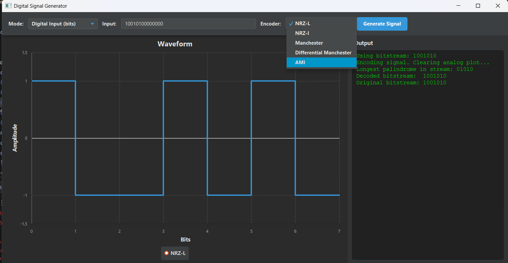
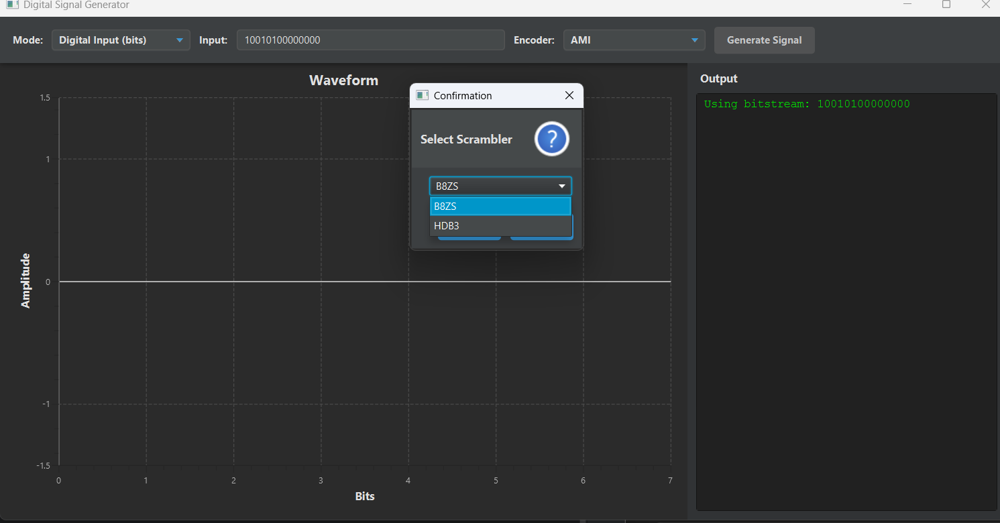
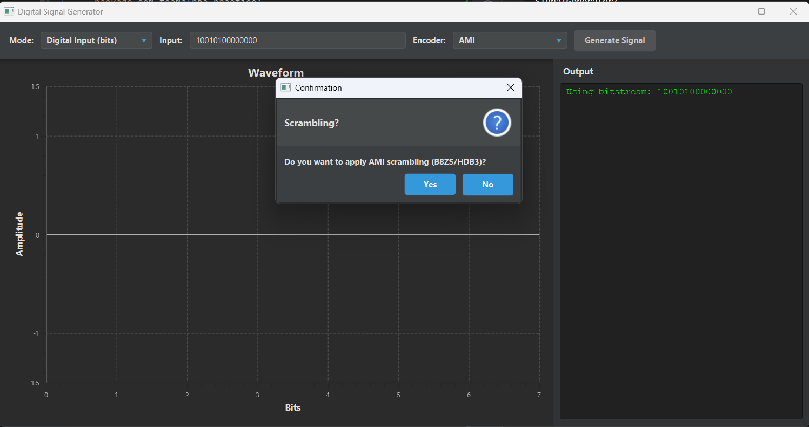
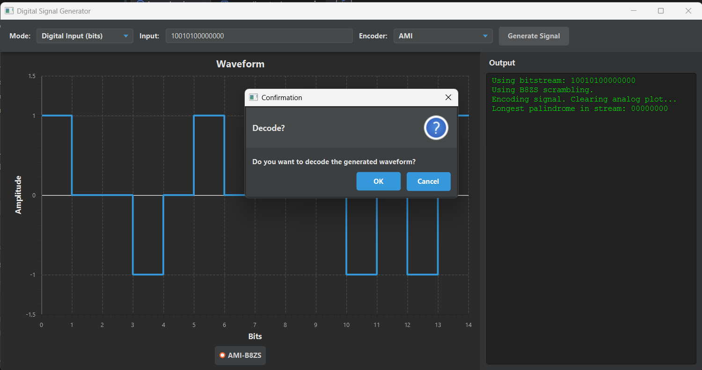
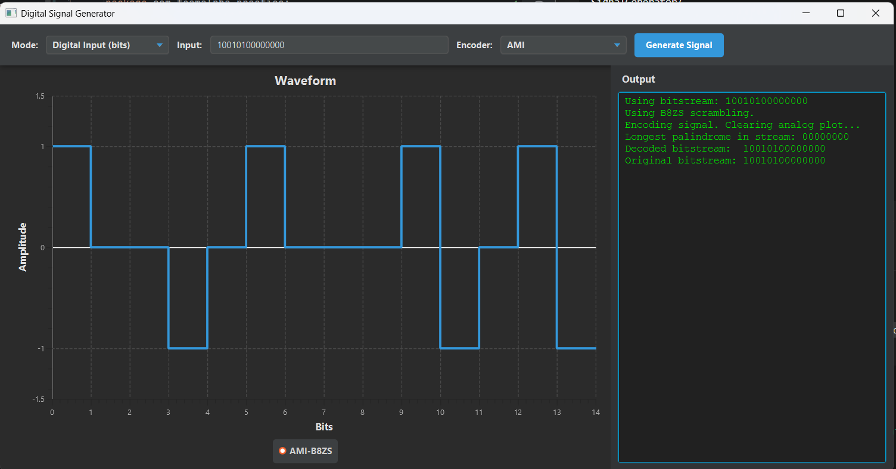

# Digital Signal Generator
### Data Communication Course Project

**Team Members:**
- [Mohammad Adab - 2023BITE016]
- [Shoaib Altaf - 2023BITE068]
- [Sheikh Samee-Ul-Haq - 2023BITE058]

---

## 🎯 Objective
Implement a **Digital Signal Generator** that performs **line coding**, **scrambling**, and **analog-to-digital conversion** using **PCM** or **Delta Modulation**, and supports waveform-based **decoding** (extra marks).

---

## ⚙️ Features

- **Input Modes**
    - **Digital:** Bitstream input → Line encoding.
    - **Analog:** Sine wave input → PCM or DM → Encoded signal.

- **Line Coding Schemes**
    - NRZ-L, NRZ-I, Manchester, Differential Manchester, AMI.

- **Scrambling**
    - Optional AMI scrambling: **B8ZS** or **HDB3**.

- **Extras**
    - **Longest Palindromic Substring** using **Manacher’s Algorithm (O(n))**.
    - **Decoder** analyzes waveform to reconstruct original bits.
    - Optimized step plotting for clean JavaFX visualization.

---

## 🧩 Decoding Assumptions

| Scheme | Note |
|---------|------|
| **NRZ-L** | Direct polarity (`1=HIGH`, `0=LOW`). |
| **NRZ-I** | First bit assumed `0`; `1` causes transition. |
| **Manchester** | First half LOW for `1`, HIGH for `0` (IEEE). |
| **Differential Manchester** | Mid-bit transition always; `0` = transition at start, `1` = no transition. First bit may differ. |
| **AMI (B8ZS/HDB3)** | Fully IEEE-compliant, verified by waveform polarity. |

---

## 🚀 How to Run

1. Open project in **IntelliJ IDEA** (or any Java IDE).
2. Ensure JavaFX SDK is configured in project settings.
3. Navigate to:  
4. Run `Launcher.main()` → GUI titled **“Digital Signal Generator”** appears.
5. Select **mode**, **encoder**, and optionally **scrambler** → click **Generate Signal**.
6. Optionally choose **Decode** to recover bitstream.

> ℹ️ *Always start from `Launcher.java` (not `HelloApplication.java`) for proper JavaFX startup.*

---

## 📄 Project Report

You can download and view the full project specification report here:

👉 [Digital_Signal_Generator_Specification_Report.pdf](./Digital_Signal_Generator_Specification_Report.pdf)

---

## 🖼️ Project Screenshots

| Feature | Screenshot |
|----------|-------------|
| **Encoding Techniques Interface** |  |
| **Scrambling Techniques Selection** |  |
| **AMI Scrambling Example (HDB3 / B8ZS)** |  |
| **Decoder Query (Prompt for Decoding)** |  |
| **Final Output with Decoded Bitstream** |  |

---

## 🧮 Algorithms & Complexity

| Component | Algorithm | Time Complexity |
|------------|------------|----------------|
| Palindrome | Manacher’s Algorithm | **O(n)** |
| Line Encoding / Decoding | Iterative | **O(n)** |
| Scrambling / Unscrambling | Zero-run substitution | **O(n)** |
| PCM / DM | Sampling & quantization | **O(n)** |

---

## 🧑‍💻 File Overview

| File | Description |
|------|--------------|
| `Launcher.java` | Entry point; launches JavaFX app. |
| `HelloApplication.java` | Main UI logic (controls, plotting, dialogs). |
| `SignalProcessor.java` | Handles encoding, PCM, DM, scrambling. |
| `Decoder.java` | Performs waveform-based decoding. |
| `Utils.java` | Palindrome finder (Manacher’s algorithm). |
| `app.css` | UI styling. |

---

## 📚 References
- B.A. Forouzan, *Data Communications and Networking*
- W. Stallings, *Data and Computer Communications*
- IEEE 802.3 / 802.4 Standards
- Manacher, G. (1975). "A New Linear-Time 'On-Line' Algorithm for Finding the Smallest Initial Palindrome of a String." Journal of the ACM (JACM), 22(3), 346–351.

---

## 🏁 Summary
A complete **digital communication simulation system** —  
encoding, modulation, scrambling, decoding, and visualization —  
built with **JavaFX** and optimized algorithms for real-time performance.
